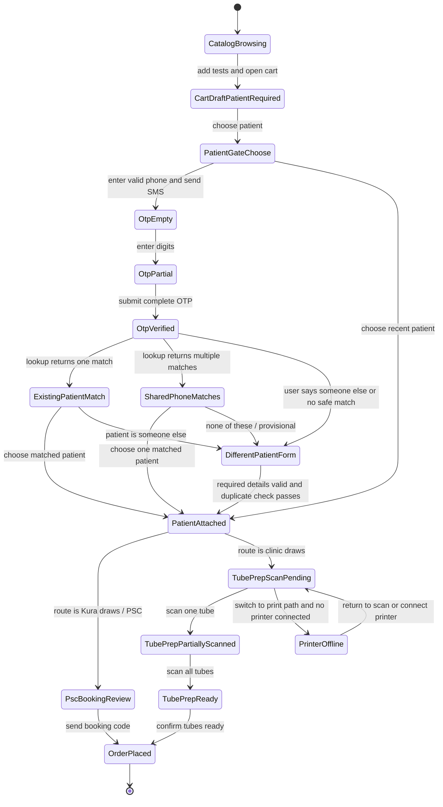
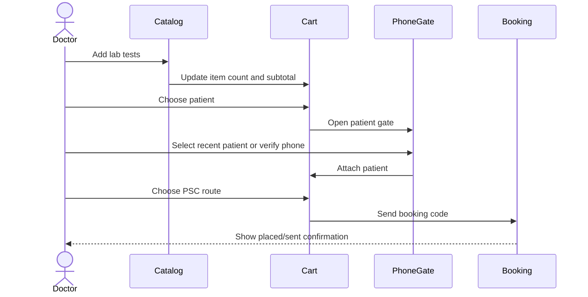
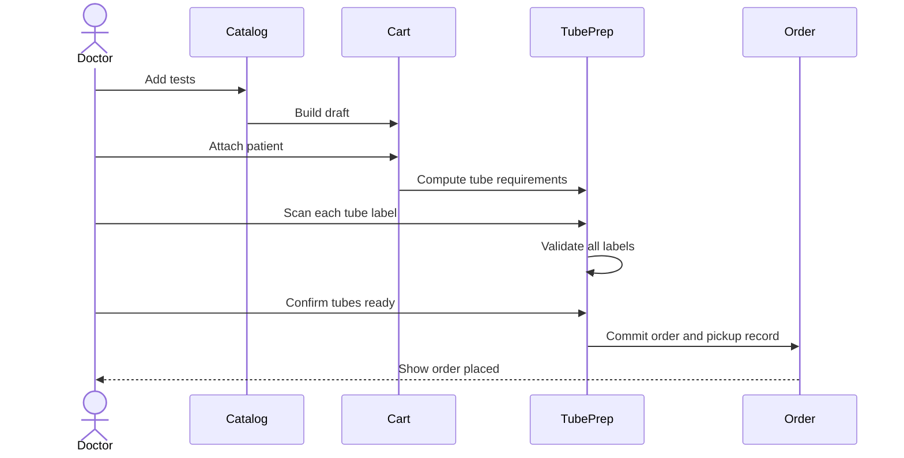

# Kura Lab Catalog Order Flow and User Journey

Source: Figma `00 Kura Brand`, section `Phone Gate`, node `807:109926`.

Last updated: 2026-06-22.

This document describes the end-to-end Lab Catalog ordering journey represented by the Figma section. It covers the catalog-first order path, the patient phone gate, the branching identity logic, the PSC booking-code path, the in-clinic tube-preparation path, and the placed-order terminal state.

The document is written as a product, UX, and implementation logic reference. It separates observed screen states from inferred transition rules where the prototype itself does not encode interactions.

## 1. Scope

### 1.1 Included

- Lab catalog browsing and test selection.
- Right-rail cart draft behavior.
- Blocking condition when the draft has tests but no attached patient.
- Patient Gate modal:
  - choose a recent patient,
  - enter a Cambodia phone number,
  - verify SMS OTP,
  - resolve known-patient, shared-phone, and different-patient cases.
- Post-patient order continuation:
  - PSC booking-code path,
  - in-clinic collection path,
  - scan labels,
  - print labels / printer-offline branch,
  - confirm tubes ready,
  - order placed.
- State logic, validation gates, user intent, data ownership, and analytics implications.

### 1.2 Excluded

- Full patient chart behavior outside the Lab Catalog context.
- Payment details beyond the visible PSC/cart subtotal states.
- Downstream lab processing after the order is placed.
- Mobile patient booking-code experience.
- Complete implementation specs for components that already have their own documents.

Related existing specs:

- `Kura Phone Gate Modal Spec.md`
- `Kura Order Cart Design Specs.md`
- `Kura Order Cart - Doctor Business Spec.md`

## 2. Actors and Responsibilities

### 2.1 Doctor / Clinic Operator

The primary user in this flow. The operator is building a lab order, attaching the correct patient, and deciding whether the patient goes to a PSC or the clinic draws samples locally.

Responsibilities:

- Select clinically appropriate tests.
- Attach the order to the correct patient or create a temporary/provisional patient safely.
- Verify the phone number when the flow requires SMS confirmation.
- Choose the correct operational route.
- If drawing in clinic, correctly label and scan every required tube before committing the order.
- Confirm the tube bag is physically ready for pickup.

### 2.2 Patient / Phone Holder

The patient or phone holder participates indirectly.

Responsibilities:

- Provide or receive the OTP.
- Confirm the phone is available for booking-code delivery.
- For PSC orders, receive a booking code and go to a Kura PSC.

### 2.3 Kura PSC / Reception

PSC staff are not directly operating this UI, but the journey hands off safety responsibility to them in some branches.

Responsibilities:

- Complete identity checks where the UI only verifies phone ownership.
- Collect samples for PSC-route orders.
- Validate temporary/provisional patient details if needed.

### 2.4 Kura Courier / Sweep Rider

Relevant to the in-clinic draw path.

Responsibilities:

- Pick up prepared tube bags during the next sweep window.
- Use pickup/handover information created only after tubes are confirmed ready.

## 3. Core Product Principle

The central safety principle is:

> The order must not become operationally real until it has enough patient, route, and sample identity information for the chosen route.

This produces two different commit models:

- PSC booking-code route: the order can be committed once tests, patient, and PSC route are valid. The patient completes sample collection at Kura.
- In-clinic draw route: the order is not fully committed until the clinic has physically prepared and labelled all required tubes.

## 4. Screen Inventory From Figma

The section contains 16 top-level frames. These are the source states for this document.

| # | Figma frame | Purpose |
|---|---|---|
| 01 | `01 - Lab Catalog - Browse Tests` | Base catalog state with browse/search/filter surfaces and a compact selected-tests cart indicator. |
| 02 | `02 - Cart Draft - Patient Required` | Draft cart contains tests and total, but cannot proceed until a patient is attached. |
| 03 | `03 - Patient Gate - Choose Patient` | Modal state for choosing a recent patient or starting phone-based verification. |
| 04 | `04 - Patient Gate - Verify Phone OTP Empty` | OTP modal after SMS is sent; no digits entered. |
| 05 | `05 - Patient Gate - Verify Phone OTP Entered` | OTP modal with partially entered code. |
| 06A | `06A - Patient Gate - Existing Patient Match` | Verified phone resolves to one likely Kura patient. |
| 06B | `06B - Patient Gate - Shared Phone Matches` | Verified phone resolves to multiple possible patients. |
| 07A | `07A - Patient Gate - Different Patient Form` | User asserts the phone belongs to another Kura patient, but the person being tested is different. |
| 07B | `07B - Patient Gate - Different Patient Form Shared Phone` | Same form pattern shown as a shared-phone/different-person branch. |
| 08A | `08A - Collection - Prepare 1 Tube Scan Pending` | In-clinic route with one required tube and zero scans completed. |
| 08B | `08B - Booking - Send PSC Booking Code` | PSC route review state with booking-code CTA. |
| 09 | `09 - Collection - Prepare 3 Tubes Scan Pending` | In-clinic route with three required tubes and zero scans completed. |
| 10 | `10 - Collection - 1 of 3 Tubes Scanned` | In-clinic route after one tube has been scanned and linked. |
| 11 | `11 - Collection - Tubes Ready To Confirm` | All required tubes have sample IDs; user can confirm tubes ready. |
| 12 | `12 - Collection - Printer Offline Label Pending` | Print-label path blocked by missing printer connection. |
| 13 | `13 - Confirmation - Order Placed` | Terminal success state after order placement / pickup confirmation. |

## 5. Persistent Page Anatomy

### 5.1 Primary Navigation

The left rail persists across catalog states.

Observed labels:

- Search
- Home
- Bookings
- Patients
- Results
- Catalog
- More
- Settings
- Account menu / initials

Logic:

- The current surface is Catalog.
- Navigation is present but should be inert while a blocking modal is open.
- During the Patient Gate, focus should remain trapped inside the modal.

### 5.2 Lab Catalog Main Area

Observed catalog elements:

- Header: `Lab catalog`
- Search input: `Search tests, panels, or keywords...`
- Shortcuts:
  - Favorites
  - Order Sets
- Categories:
  - All
  - Order Sets
  - Glycemic control
  - Lipids
  - Renal function
  - Liver function
  - Hematology
  - Cardiac
  - Thyroid
  - Endocrine
  - Vitamins
  - Hormones
  - Infectious
  - Tumor markers
- Sample filters:
  - Blood
  - Urine
  - Saliva
  - Swab
- Suggested sets:
  - Diabetes follow-up
  - Cardiac risk
  - Annual screen
- Named order sets:
  - Leon
  - tr
  - An
  - Hey
  - leon
  - Diabetes panel
  - Cardiac panel
  - Renal panel
  - Metabolic panel
- Missing-test escalation:
  - `Test you need is not here?`
  - `Suggest a test`

Logic:

- The user may browse by category, search globally, add suggested tests, or add named order sets.
- The cart updates immediately as tests are selected.
- The catalog can be used before knowing the patient. This is intentionally an items-first flow.
- Patient attachment is deferred until checkout or order continuation.

### 5.3 Cart / Right Rail

The cart state changes by journey phase.

Observed draft states:

- Compact selected-tests button, for example:
  - `14 tests selected - $124.00`
  - `2 tests selected - $23.00`
  - `3 tests selected - $46.00`
- Expanded draft:
  - `Order draft`
  - item count
  - `Choose a patient`
  - `Needed before sending`
  - item names and prices
  - subtotal in USD and KHR

Logic:

- The cart can contain items without a patient.
- The cart cannot send, place, or prepare an order until a patient is attached.
- Once a patient is attached, the rail switches from generic draft to patient-specific order context.

## 6. High-Level State Machine



## 7. Core Data Objects

### 7.1 OrderDraft

Represents the cart before operational commitment.

Suggested fields:

```ts
type OrderDraft = {
  id: string;
  status: "empty" | "building" | "patient_required" | "patient_attached" | "preparing" | "placed";
  sourceSurface: "lab_catalog";
  items: LabTestItem[];
  subtotalUsd: number;
  subtotalKhr?: number;
  patient?: AttachedPatient;
  route?: "psc_walk_in" | "clinic_draw";
  tubeRequirements?: TubeRequirement[];
};
```

Invariant:

- `items.length > 0` is required before any patient gate or route step matters.
- `patient` is required before booking-code send or tube preparation commit.

### 7.2 LabTestItem

Represents a selected test or panel item.

Observed examples:

- 2h postprandial
- HDL-C
- Total cholesterol
- Lipoprotein(a)
- Apo AI
- LDL-C
- HbA1c
- Random glucose
- Fasting glucose
- Triglycerides
- Creatinine + eGFR
- Uric acid
- Albumin/creatinine ratio
- Creatinine clearance
- Cystatin C
- OGTT (gestational)

Suggested fields:

```ts
type LabTestItem = {
  id: string;
  name: string;
  priceUsd: number;
  category?: string;
  source?: "catalog" | "suggested" | "order_set" | "favorite";
  sampleRequirement?: SampleRequirement;
};
```

### 7.3 PhoneVerificationSession

Represents the OTP process.

```ts
type PhoneVerificationSession = {
  phoneCountry: "KH";
  nationalPhone: string;
  e164Phone: string;
  otpStatus: "not_sent" | "sent" | "partial" | "complete" | "verifying" | "verified" | "failed" | "expired";
  lookupResult?: "single_match" | "multiple_matches" | "no_match" | "error";
  matchedPatients?: PatientCandidate[];
};
```

Invariant:

- A phone change invalidates the OTP.
- A verified phone should be displayed as locked unless the user explicitly changes it.
- OTP digits must never be logged.

### 7.4 PatientCandidate

Represents a possible Kura identity returned by phone lookup.

Observed examples:

- Sokha Chann / Sokha C.
- Sophea C.
- Rithy K.
- Visal H.
- Dara Pich
- Bopha Lim

Suggested fields:

```ts
type PatientCandidate = {
  id: string;
  displayName: string;
  initials: string;
  sex?: "female" | "male" | "other";
  age?: number;
  maskedRecordId?: string;
  matchReason: "verified_phone" | "shared_phone" | "recent_patient";
};
```

### 7.5 AttachedPatient

Represents the patient after the gate resolves.

```ts
type AttachedPatient = {
  type: "existing" | "temporary" | "provisional";
  id: string;
  displayName: string;
  phoneVerified: boolean;
  identityStatus: "kura_record" | "phone_checked" | "psc_will_confirm_identity";
  auditReason?: "shared_phone_override" | "different_patient" | "no_match";
};
```

Important distinction:

- `phoneVerified` does not mean identity verified.
- Temporary/provisional patients should remain visibly provisional until PSC or reception completes identity checks.

### 7.6 TubeRequirement

Represents the minimal physical sample set for in-clinic draw.

Observed examples:

- `EDTA purple - 3 mL`
- `SST gold - 5 mL`
- `Urine cup - 10 mL`

Suggested fields:

```ts
type TubeRequirement = {
  id: string;
  tubeType: "edta_purple" | "sst_gold" | "urine_cup";
  volumeMl?: number;
  tests: string[];
  labelStatus: "not_labelled" | "label_printed" | "scanned";
  sampleId?: string;
};
```

Invariant:

- The clinic-draw order cannot be committed until every required tube has a valid label/sample identity.

## 8. Detailed User Journey

### 8.1 Journey Phase 1 - Browse Lab Catalog

Screen:

- `01 - Lab Catalog - Browse Tests`

User goal:

- Build a test list quickly without leaving the catalog.

Observed UI:

- The page title is `Lab catalog`.
- Search is globally available.
- Suggested cards provide high-frequency bundles.
- Filters support category and sample-type browsing.
- Existing named order sets are available.
- A compact cart affordance shows the current selected item count and total.

Primary user actions:

1. Search for a test, panel, or keyword.
2. Filter by category.
3. Add suggested panels.
4. Add a named order set.
5. Remove an already-added set or item.
6. Open the cart.
7. Suggest a missing test.

System responses:

- Adding a test increments item count.
- Cart total updates.
- Added items should show a reversible state.
- No patient is required at this phase.

Validation:

- The user may continue browsing with zero tests.
- Checkout or order continuation requires at least one selected test.

Exit conditions:

- If no items are selected, the user remains in browsing mode.
- If items are selected and the cart opens, the flow moves to cart draft review.

### 8.2 Journey Phase 2 - Review Draft Cart Without Patient

Screen:

- `02 - Cart Draft - Patient Required`

User goal:

- Review selected tests and discover what is still blocking order send.

Observed UI:

- Right rail title: `Order draft`.
- Item count: `14`.
- Blocker: `Choose a patient`.
- Supporting copy: `Needed before sending`.
- Itemized lab tests with prices.
- Subtotal: `$124.00`.
- KHR mirror: approximately `KHR 508,400`.
- CTA: `Choose patient`.

Primary user actions:

1. Review selected tests.
2. Remove or adjust items if needed.
3. Click `Choose patient`.

System responses:

- If the user clicks `Choose patient`, the Patient Gate modal opens.
- Background catalog remains visible but should become inert while the modal is active.

Blocking logic:

```ts
const canSendOrder =
  order.items.length > 0 &&
  order.patient != null;

const patientBlocker =
  order.items.length > 0 && order.patient == null
    ? "Choose a patient"
    : null;
```

Exit conditions:

- The only valid path forward is attaching a patient.

### 8.3 Journey Phase 3 - Choose Patient

Screen:

- `03 - Patient Gate - Choose Patient`

User goal:

- Attach the correct patient as quickly as possible while allowing phone-first lookup.

Observed UI:

- Modal title: `Choose patient`.
- Recent candidates:
  - Sokha Chann
  - Dara Pich
  - Bopha Lim
- Each candidate shows initials and demographic/record metadata.
- Alternative entry: `or enter a phone`.
- Country context: Cambodia, `+855`, `KH`.
- Phone input example: `12 345 678`.
- CTA: `Send SMS code`.
- Prototype test cases show known/shared/guardian/new/duplicate phones.

Primary user actions:

1. Choose a recent patient using `Use`.
2. Enter a Cambodia phone number.
3. Send an SMS code.
4. Close the modal.

System responses:

- Choosing a recent patient can attach that patient if the product trusts the recent context.
- Entering a valid phone enables SMS submission.
- Sending SMS creates a phone verification session and transitions to OTP entry.

Validation:

```ts
const canSendSms =
  phone.country === "KH" &&
  isValidCambodiaNationalPhone(phone.nationalNumber);
```

Safety logic:

- Recent patient selection is fastest, but should still show enough demographic evidence to avoid attaching the wrong patient.
- Phone entry is the deduplication and shared-phone route.

Exit conditions:

- Recent patient selected -> `patient_attached`.
- Valid phone submitted -> OTP state.

### 8.4 Journey Phase 4 - Verify Phone OTP

Screens:

- `04 - Patient Gate - Verify Phone OTP Empty`
- `05 - Patient Gate - Verify Phone OTP Entered`

User goal:

- Prove control of the phone number before using it as a patient lookup or booking-code destination.

Observed UI:

- Back action: `Change phone`.
- Title: `Verify number`.
- Instruction: enter the 6-digit SMS code read by the patient or phone holder.
- Masked phone display: `+855 70 ... 496`.
- Six OTP boxes.
- CTA: `Verify code`.
- Prototype helper: `Prototype OTP: 123456`.
- Partial-entry state shows digits `1`, `2`, `3`, `4`, `5`.

Primary user actions:

1. Enter OTP digits.
2. Paste a 6-digit OTP.
3. Click `Verify code`.
4. Click `Change phone`.

System responses:

- Digits populate left to right.
- `Verify code` is disabled until six digits are present.
- `Change phone` returns to phone entry and clears OTP state.
- Successful verification triggers patient lookup.

Validation:

```ts
const canVerifyOtp =
  otp.value.length === 6 &&
  otp.value.every((char) => /[0-9]/.test(char));
```

Error states required but not shown in the Figma section:

- Invalid code.
- Expired code.
- Resend countdown.
- Rate limit.
- SMS delivery failure.
- Network failure.

Exit conditions after successful OTP:

- Phone maps to one Kura patient -> Existing Patient Match.
- Phone maps to multiple Kura patients -> Shared Phone Matches.
- Phone maps to no safe/confirmed patient -> Different Patient / temporary patient form.

### 8.5 Journey Phase 5A - Existing Patient Match

Screen:

- `06A - Patient Gate - Existing Patient Match`

User goal:

- Confirm whether the verified phone belongs to the person being tested.

Observed UI:

- Back action: `Change phone`.
- Title: `Is this the patient?`
- Candidate:
  - `Sokha C.`
  - initials `SC`
  - `Female - 32y - Kura record ...34`
- CTA on card: `Choose`.
- Secondary option: `None of these, add provisional patient` or equivalent different-person route.

Primary user actions:

1. Choose the matched patient.
2. Indicate this is someone else / none of these.
3. Change phone.

System responses:

- `Choose` attaches the existing patient and closes the modal.
- Someone-else path opens the different-patient form.
- Change phone clears OTP and lookup state.

Logic:

```ts
if (lookupResult.type === "single_match") {
  showExistingPatientMatch(lookupResult.patient);
}

if (userChoosesMatchedPatient) {
  attachPatient({
    type: "existing",
    phoneVerified: true,
    identityStatus: "kura_record"
  });
}
```

Safety requirements:

- Keep PHI minimal.
- Show enough metadata to avoid wrong-record attachment.
- Keep the different-person escape path clearly visible.

Exit conditions:

- Matched patient chosen -> route/order continuation.
- Someone else -> Different Patient Form.

### 8.6 Journey Phase 5B - Shared Phone Matches

Screen:

- `06B - Patient Gate - Shared Phone Matches`

User goal:

- Resolve a shared phone number without silently attaching the wrong patient.

Observed UI:

- Title: `Choose patient`.
- Warning/safety heading: `Before sending`.
- Identity explanation:
  - `Match the phone to the person being tested. SMS confirms the phone, not identity.`
- Lookup result:
  - `This number is linked to 3 patients`.
- Candidate list:
  - Sophea C.
  - Rithy K.
  - Visal H.
- Each patient card has `Choose`.
- Secondary action:
  - `None of these, add provisional patient`.

Primary user actions:

1. Choose one of the matched patients.
2. Add a provisional patient if none match.
3. Change phone.

System responses:

- Choosing a listed patient attaches an existing Kura record.
- None-of-these opens a provisional/different-patient creation flow.

Logic:

```ts
if (lookupResult.type === "multiple_matches") {
  showSharedPhoneMatches(lookupResult.patients);
}

const canAttachExistingFromSharedPhone =
  selectedPatientId != null &&
  selectedPatientId in lookupResult.patients;
```

Safety requirements:

- The copy must explicitly state that SMS verifies phone possession, not person identity.
- The UI must not imply that OTP alone chooses the patient.
- The provisional path should be available but logged/audited.

Exit conditions:

- Existing patient chosen -> route/order continuation.
- None match -> Different Patient Form.

### 8.7 Journey Phase 5C - Different Patient / Provisional Patient Form

Screens:

- `07A - Patient Gate - Different Patient Form`
- `07B - Patient Gate - Different Patient Form Shared Phone`

User goal:

- Continue safely when the phone is verified but the person being tested is not the matched Kura patient.

Observed UI:

- Back action: `Change phone`.
- Warning title: `This looks like a different patient`.
- Warning body:
  - `This phone belongs to another Kura patient. Confirm this is a different person.`
- Verified phone row:
  - country `KH`
  - `+855`
  - `070 123 496`
  - phone checked / lock affordance.
- Required fields:
  - `Full name`
  - `DOB or age`
  - `Sex`
- Placeholders:
  - `Patient name`
  - `12-09-1994 or 32`
- Sex options:
  - Female
  - Male
  - Other
- Confirmation checkbox:
  - `I confirmed the matched Kura patient is not the person being tested.`
- CTA:
  - `Check for existing patient`
- Helper copy:
  - `Add name, DOB or age, and sex before duplicate check.`

Primary user actions:

1. Fill required patient details.
2. Select sex.
3. Confirm mismatch.
4. Trigger duplicate check.
5. Change phone.

System responses:

- The verified phone remains locked.
- Changing phone invalidates OTP and lookup.
- CTA remains disabled until required fields and explicit mismatch confirmation are complete.
- Duplicate check should run before creating a temporary/provisional patient.

Validation:

```ts
const canCheckForExistingPatient =
  phone.status === "verified" &&
  patientDraft.fullName.trim().length > 0 &&
  patientDraft.dobOrAge.trim().length > 0 &&
  patientDraft.sex != null &&
  mismatchConfirmed === true;
```

Duplicate-check outcomes:

- Hard match found -> return to a match-selection state.
- Soft match found -> show non-blocking duplicate warning or review panel.
- No match found -> create temporary/provisional patient.
- Lookup error -> block submission and show retry.

Audit requirements:

- This branch should create an audit event because it intentionally overrides a known/shared-phone risk.
- The event must not log raw phone, OTP, DOB, or full patient details in analytics.

Exit conditions:

- Existing patient found and chosen -> route/order continuation.
- No existing patient found -> attach provisional patient and continue.
- User changes phone -> return to phone entry.

## 9. Post-Patient Routing

Once a patient is attached, the order can continue into one of two route families.

### 9.1 Route A - PSC Booking Code

Screen:

- `08B - Booking - Send PSC Booking Code`

User goal:

- Send the patient to a Kura PSC with a booking code.

Observed UI:

- Right rail title: `Order for Sokha Chann`.
- Item count: `2`.
- Itemized prices:
  - Creatinine clearance: `$16.00`
  - Cystatin C: `$22.00`
- Add-to context:
  - `Standalone lab order`
- Route explanation:
  - `Sample route`
  - `Patient receives a booking code and goes to a Kura PSC for collection.`
  - `Patient -> PSC`
  - `Tubes -> Kura`
- Subtotal: `$38.00`.
- KHR mirror: approximately `KHR 155,800`.
- CTA: `Send booking code`.

Primary user actions:

1. Review patient.
2. Review selected tests and prices.
3. Confirm PSC route.
4. Click `Send booking code`.

System responses:

- A booking code is generated.
- Booking instructions are delivered via the verified communication channel.
- Order becomes visible as a placed PSC order.

Commit logic:

```ts
const canSendBookingCode =
  order.items.length > 0 &&
  order.patient != null &&
  order.route === "psc_walk_in";
```

Exit condition:

- Successful send -> Order Placed state or PSC success card.

### 9.2 Route B - Clinic Draw / Tube Preparation

Screens:

- `08A - Collection - Prepare 1 Tube Scan Pending`
- `09 - Collection - Prepare 3 Tubes Scan Pending`
- `10 - Collection - 1 of 3 Tubes Scanned`
- `11 - Collection - Tubes Ready To Confirm`
- `12 - Collection - Printer Offline Label Pending`
- `13 - Confirmation - Order Placed`

User goal:

- Prepare physical samples safely before the order enters operational pickup status.

Observed UI:

- Right rail title: `Order for Sokha Chann`.
- Patient context:
  - `For Sokha Chann`
  - initials `SC`
  - record `P-9134`
- Navigation backstop:
  - `Back to draft`
- Method controls:
  - `Scan`
  - `Print`
- Sweep copy:
  - `Sweep 14:15-14:30 - Sok S. - leave bag at reception`

Core rule:

- A clinic-draw order is not placed until tubes are correctly labelled/scanned and the user confirms readiness.

## 10. Tube Preparation Logic

### 10.1 One-Tube Scan Pending

Screen:

- `08A - Collection - Prepare 1 Tube Scan Pending`

Observed UI:

- `Prepare 1 tube`
- `2 tests ordered`
- Tube:
  - `SST gold - 5 mL`
  - `OGTT (gestational) - 2h postprandial`
- Instruction:
  - `Stick a Kura label on each tube, then tap its row to scan.`
- Progress:
  - `0 of 1 scanned`
- Cart summary:
  - `2 tests selected - $23.00`

Logic:

```ts
const scanProgress = {
  required: 1,
  scanned: 0
};

const canConfirmTubesReady = scanProgress.scanned === scanProgress.required;
```

Exit conditions:

- Scan the single tube -> ready-to-confirm state.
- Switch to print path -> printer branch.
- Back to draft -> return to editable cart.

### 10.2 Three-Tube Scan Pending

Screen:

- `09 - Collection - Prepare 3 Tubes Scan Pending`

Observed UI:

- `Prepare 3 tubes`
- `3 tests ordered`
- Tube requirements:
  - `EDTA purple - 3 mL` for `HbA1c`
  - `SST gold - 5 mL` for `Cystatin C`
  - `Urine cup - 10 mL` for `Creatinine clearance`
- Progress:
  - `0 of 3 scanned`
- Cart summary:
  - `3 tests selected - $46.00`

Logic:

- The system derives minimal tube requirements from selected tests.
- Tests are grouped by compatible tube/sample type.
- Every tube must get a distinct Kura sample ID.

Exit conditions:

- Scan one tube -> partial scan state.
- Scan all tubes -> ready-to-confirm state.
- Switch to print path -> printer branch.

### 10.3 Partial Scan

Screen:

- `10 - Collection - 1 of 3 Tubes Scanned`

Observed UI:

- Progress:
  - `1 of 3 scanned`
- Scanned sample ID:
  - `261000000007`
- Undo action appears for the scanned tube.
- Remaining tubes are still pending.

Primary user actions:

1. Continue scanning remaining tubes.
2. Undo a scanned tube if the label/sample association is wrong.
3. Switch method or return to draft.

Logic:

```ts
const canUndoScan = tube.labelStatus === "scanned";

function scanTube(tubeId: string, sampleId: string) {
  assert(isKuraSampleId(sampleId));
  assert(!sampleIdAlreadyUsed(sampleId));
  linkSampleIdToTube(tubeId, sampleId);
}
```

Required scanner error logic:

- Unknown code: block if the code is not a Kura sample label.
- Duplicate code: block if the same code is already linked to another tube.
- Camera unavailable: provide print/manual fallback.
- Wrong tube selection: allow undo before confirmation.

Exit condition:

- All required tubes scanned -> ready-to-confirm state.

### 10.4 All Tubes Ready

Screen:

- `11 - Collection - Tubes Ready To Confirm`

Observed UI:

- Sample IDs:
  - `261000000007`
  - `261000000021`
  - `261000000035`
- CTA:
  - `Confirm - tubes ready`
- Cart summary:
  - `3 tests selected - $46.00`

Primary user actions:

1. Review labels and tube mappings.
2. Confirm that tubes are physically ready.
3. Undo a tube if a scan is wrong before confirming.

Commit logic:

```ts
const canConfirmTubesReady =
  order.route === "clinic_draw" &&
  order.patient != null &&
  order.tubeRequirements.length > 0 &&
  order.tubeRequirements.every(
    (tube) => tube.labelStatus === "scanned" && tube.sampleId != null
  );
```

System response:

- Once confirmed, the order becomes operational.
- A pickup/sweep record is created.
- The user is shown the placed-order state.

Exit condition:

- Confirm -> Order Placed.

### 10.5 Printer Offline / Label Pending

Screen:

- `12 - Collection - Printer Offline Label Pending`

Observed UI:

- `Prepare 1 tube`
- `NO PRINTER`
- `Link printer`
- Tube:
  - `SST gold - 5 mL`
  - `OGTT (gestational) - 2h postprandial`
- Instruction:
  - `Print one label per tube, then apply.`
- Progress:
  - `0 of 1 labelled`
- Cart summary:
  - `2 tests selected - $23.00`

Primary user actions:

1. Link a printer.
2. Return to Scan method.
3. Back to draft.

Blocking logic:

```ts
const canPrintLabels =
  printer.status === "connected" &&
  order.tubeRequirements.length > 0;

const canConfirmAfterPrint =
  order.tubeRequirements.every((tube) =>
    tube.labelStatus === "label_printed" || tube.labelStatus === "scanned"
  );
```

Safety note:

- Printed labels still need to be physically applied to the right tube.
- If the product treats printing as sufficient, it must still protect against duplicate or missing labels.
- The scan path is safer because it confirms the physical label/tube association.

Exit conditions:

- Printer connected and labels printed -> labelled/ready state.
- Scan tab selected -> scan pending state.

## 11. Terminal State - Order Placed

Screen:

- `13 - Confirmation - Order Placed`

User goal:

- Confirm that the order has been accepted and know what happens next.

Observed UI:

- Status: `Order placed`.
- Sweep window:
  - `14:15-14:30 - Sok S.`
- Next-step instruction:
  - `Next sweep - leave the tube bag at reception`
- Order summary:
  - `Routine - 2 items - $23.00`
  - `ORD-0001`
- CTA:
  - `Start new order`

System response:

- Order is now committed.
- The draft should be frozen or replaced by a new empty draft.
- Tube pickup workflow is active.
- Start-new-order resets the catalog/order context.

Exit condition:

- `Start new order` -> return to catalog browsing with a clean cart.

## 12. Happy Paths

### 12.1 Happy Path A - Catalog to PSC Booking Code



Detailed logic:

1. User adds one or more tests.
2. Cart shows selected tests and total.
3. User opens patient gate.
4. User attaches an existing patient or creates a provisional patient through a safe branch.
5. System unlocks route continuation.
6. User selects PSC route.
7. System confirms patient will receive a booking code and go to PSC.
8. User clicks `Send booking code`.
9. System commits the order and delivers code via the verified channel.

### 12.2 Happy Path B - Catalog to Clinic Draw



Detailed logic:

1. User selects tests.
2. User attaches patient.
3. User chooses clinic draw.
4. System derives minimal tube set from tests.
5. User labels and scans every required tube.
6. System blocks confirmation until every tube has a valid sample ID.
7. User confirms tubes are physically ready.
8. System commits the order.
9. System shows sweep/pickup instruction and order ID.

## 13. Branch and Edge Case Logic

### 13.1 Empty Cart

Condition:

```ts
order.items.length === 0
```

Expected behavior:

- Do not show patient-required blocker.
- Do not open Patient Gate from checkout.
- CTA should read as browse/add-tests guidance.

### 13.2 Cart Has Tests But No Patient

Condition:

```ts
order.items.length > 0 && order.patient == null
```

Expected behavior:

- Show `Choose a patient`.
- Prevent send/booking/collection continuation.
- Preserve cart items while the user resolves patient identity.

### 13.3 Recent Patient Selected

Condition:

```ts
patientCandidate.source === "recent"
```

Expected behavior:

- Attach directly if the candidate is trusted in context.
- Otherwise require phone confirmation depending on product policy.
- Always preserve a visible way to change patient before commit.

### 13.4 Verified Phone Has One Match

Condition:

```ts
phone.status === "verified" &&
lookupResult.type === "single_match"
```

Expected behavior:

- Show single match card.
- User must explicitly choose the patient.
- Do not auto-attach on lookup alone.

### 13.5 Verified Phone Has Multiple Matches

Condition:

```ts
phone.status === "verified" &&
lookupResult.type === "multiple_matches"
```

Expected behavior:

- Show all candidates with minimal PHI.
- Show explicit safety copy that OTP verifies phone, not identity.
- Require user selection.
- Provide provisional escape path.

### 13.6 Verified Phone Belongs To Someone Else

Condition:

```ts
phone.status === "verified" &&
userDeclaresDifferentPatient === true
```

Expected behavior:

- Show warning banner.
- Lock verified phone.
- Require name, DOB/age, sex, and explicit confirmation.
- Run duplicate check before creating provisional patient.
- Log audit-safe event.

### 13.7 No Match Found

The exact no-match state is documented in `Kura Phone Gate Modal Spec.md` and is implied by the Figma test cases even if not fully represented in this node set.

Expected behavior:

- Show details form with calmer info copy, not a warning.
- Require minimum patient details.
- Attach temporary/provisional patient after duplicate check.
- Label downstream identity as `Phone checked`, not ID verified.

### 13.8 OTP Failure

Expected behavior:

- Stay in OTP state.
- Preserve entered phone.
- Clear or mark invalid OTP.
- Offer retry/resend according to rate limit.
- Do not run patient lookup.

### 13.9 User Changes Phone After OTP

Expected behavior:

```ts
function changePhone() {
  clearOtp();
  clearLookupResult();
  setPhoneStatus("unverified");
}
```

### 13.10 User Abandons Clinic Draw Before Confirming Tubes

Condition:

```ts
order.route === "clinic_draw" &&
order.status === "preparing" &&
userLeavesBeforeConfirm === true
```

Expected behavior:

- Do not create a placed order.
- Preserve draft if possible.
- Warn if scanned labels would be orphaned.

### 13.11 Duplicate Sample Label

Condition:

```ts
sampleIdAlreadyUsed(scannedSampleId) === true
```

Expected behavior:

- Reject the scan.
- Explain which tube/order already uses it if safe.
- Do not allow confirmation until resolved.

### 13.12 Printer Offline

Condition:

```ts
selectedMethod === "print" &&
printer.status !== "connected"
```

Expected behavior:

- Show `NO PRINTER`.
- Offer `Link printer`.
- Keep order uncommitted.
- Allow fallback to scan.

## 14. CTA Enablement Matrix

| CTA | Enabled when | Disabled reason |
|---|---|---|
| Add test | Test is available and not already blocked by catalog policy | Unavailable, locked, or already processing |
| Choose patient | Cart has at least one item | Empty cart or non-checkout context |
| Send SMS code | Cambodia phone is valid | Empty or invalid phone |
| Verify code | Six numeric OTP digits are present | OTP incomplete |
| Choose matched patient | A candidate is displayed | No candidate selected or lookup failed |
| Check for existing patient | Verified phone, name, DOB/age, sex, mismatch confirmation | Missing required fields or phone not verified |
| Send booking code | Items, patient, and PSC route are valid | Missing patient, no route, no items |
| Scan tube | Tube exists and scanner is available | No camera, unsupported browser, route not clinic draw |
| Print labels | Printer connected and tube requirements exist | No printer connected |
| Confirm tubes ready | Every required tube has a valid label/sample ID | One or more tubes unlabelled/unscanned |
| Start new order | Order is placed | Order not yet terminal |

## 15. Business Rules

### 15.1 Patient Rules

- Every operational order needs a patient.
- Phone verification confirms control of the phone, not legal identity.
- A single phone may legitimately map to multiple patients.
- Shared-phone resolution must be explicit.
- Different-patient creation must be auditable.
- Temporary/provisional patients should be marked as such downstream.
- PSC/reception can finish identity confirmation later.

### 15.2 Cart Rules

- Tests can be selected before patient attachment.
- Item totals update immediately.
- A draft with tests but no patient is blocked.
- Route-specific UI appears only after patient context exists.

### 15.3 PSC Route Rules

- Booking code can be sent after patient and item validation.
- The patient receives code and goes to PSC.
- Tube collection happens at Kura PSC.
- The order can commit before any tube exists in the clinic.

### 15.4 Clinic Draw Rules

- Tube requirements are computed from tests.
- The order remains in a preparing/not-yet-placed state until labels are complete.
- Each tube needs a unique sample identity.
- User must explicitly confirm tubes are ready.
- Pickup instructions appear after confirmation.

### 15.5 Label Rules

- Scan path validates physical label association.
- Print path requires printer connection and label application.
- Duplicate labels are rejected.
- Unknown/non-Kura labels are rejected.
- Undo is available before final confirmation.

## 16. UX Requirements

### 16.1 Modal Behavior

- Use a modal focus trap.
- Background catalog should be visible but inert.
- Do not close on accidental backdrop click during identity-sensitive work.
- Return focus to the trigger after close.
- Preserve cart state across modal transitions.

### 16.2 Copy Tone

Use calm, specific operational language.

Preferred:

- `Choose patient`
- `Verify number`
- `This number is linked to 3 patients`
- `SMS confirms the phone, not identity`
- `Check for existing patient`
- `Confirm - tubes ready`

Avoid:

- `OK`
- `Submit`
- `Patient verified` when only phone is verified.
- Vague errors like `Something went wrong`.

### 16.3 Safety Framing

- Warnings should explain the operational risk.
- Color must not be the only warning signal.
- The user must always have a way to avoid attaching the wrong patient.
- The UI should distinguish phone confirmation from identity confirmation.

### 16.4 Density and Continuity

- The catalog is dense and operational.
- Do not replace it with a marketing or education surface.
- Preserve context while opening the cart or patient gate.
- Keep right-rail progress visible where possible.

## 17. Implementation State Model

### 17.1 Top-Level Order Flow

```ts
type LabCatalogOrderFlowState =
  | { name: "catalog_browsing"; order: OrderDraft }
  | { name: "cart_patient_required"; order: OrderDraft }
  | { name: "patient_gate"; order: OrderDraft; gate: PatientGateState }
  | { name: "route_review"; order: OrderDraft }
  | { name: "psc_booking_review"; order: OrderDraft }
  | { name: "tube_preparation"; order: OrderDraft; tubeState: TubePrepState }
  | { name: "order_placed"; orderId: string };
```

### 17.2 Patient Gate

```ts
type PatientGateState =
  | { name: "choose_patient" }
  | { name: "otp_empty"; phone: PhoneVerificationSession }
  | { name: "otp_partial"; phone: PhoneVerificationSession }
  | { name: "otp_verifying"; phone: PhoneVerificationSession }
  | { name: "existing_patient_match"; phone: PhoneVerificationSession; candidate: PatientCandidate }
  | { name: "shared_phone_matches"; phone: PhoneVerificationSession; candidates: PatientCandidate[] }
  | { name: "different_patient_form"; phone: PhoneVerificationSession; draft: TemporaryPatientDraft }
  | { name: "error"; recoverable: boolean; message: string };
```

### 17.3 Tube Prep

```ts
type TubePrepState =
  | { name: "scan_pending"; scanned: number; required: number }
  | { name: "partially_scanned"; scanned: number; required: number }
  | { name: "ready_to_confirm"; scanned: number; required: number }
  | { name: "printer_offline"; labelled: number; required: number }
  | { name: "printing"; labelled: number; required: number };
```

## 18. Analytics and Audit

### 18.1 Product Analytics Events

Track behavior, not PHI.

Recommended events:

- `lab_catalog_viewed`
- `lab_catalog_test_added`
- `lab_catalog_order_set_added`
- `lab_catalog_cart_opened`
- `lab_catalog_patient_required_shown`
- `phone_gate_opened`
- `phone_gate_recent_patient_selected`
- `phone_gate_phone_submitted`
- `phone_gate_otp_sent`
- `phone_gate_otp_verified`
- `phone_gate_lookup_result_shown`
- `phone_gate_existing_patient_chosen`
- `phone_gate_shared_phone_patient_chosen`
- `phone_gate_different_patient_started`
- `phone_gate_duplicate_check_started`
- `phone_gate_temporary_patient_created`
- `order_route_selected`
- `psc_booking_code_sent`
- `tube_prep_started`
- `tube_label_scanned`
- `tube_label_scan_rejected`
- `tube_label_undo_clicked`
- `printer_link_clicked`
- `tubes_ready_confirmed`
- `order_placed`
- `start_new_order_clicked`

Safe event properties:

- `source_surface`
- `order_item_count`
- `subtotal_bucket`
- `route`
- `lookup_result`
- `candidate_count`
- `created_patient_type`
- `tube_count`
- `scan_count`
- `printer_status`
- `error_code`

Do not log:

- Raw phone numbers.
- OTP digits.
- Full patient names.
- DOB or age values.
- Full sample IDs if not needed for analytics.

### 18.2 Audit Events

Audit logs can be more operationally specific than analytics but should still follow privacy and access rules.

Recommended audit events:

- Different-patient override from known phone.
- Provisional patient creation.
- Duplicate-check result.
- Sample label scan.
- Sample label undo.
- Duplicate sample label rejection.
- Tubes-ready confirmation.
- Printer connection change.

## 19. Detailed Interaction Map

This section describes exactly how the user interacts with the flow: what they click, where the click happens, what the system checks, what data changes, and which screen/state appears next.

Important prototype note:

- The Figma section primarily represents static state frames.
- Most frames do not appear to have Figma prototype reactions wired on the action nodes.
- Therefore, the transitions below are the product-specified interaction contract inferred from the visible UI, frame names, and existing Kura order-cart / phone-gate specs.
- Implementation should wire these transitions explicitly in product code rather than relying on Figma prototype links.

### 19.1 Interaction Contract Format

Each interaction should be implemented as a state transition with these fields:

```ts
type InteractionTransition = {
  fromState: string;
  clickTarget: string;
  preconditions: string[];
  userIntent: string;
  systemActions: string[];
  nextState: string;
  failureStates?: string[];
};
```

Interaction rules:

- Every visible CTA must either be enabled with a clear destination or disabled with a visible reason.
- A click that changes route, patient, tube status, or order status must be represented as a named event.
- Modal actions should not mutate the underlying cart until the modal completes successfully, except for safe local input state.
- The catalog and cart remain visually present behind Patient Gate modals, but interaction is blocked by the modal focus trap.
- The browser/app back affordance should not silently discard a partially completed patient gate or tube prep step.

### 19.2 Master Frame-to-Frame Transition Table

| From frame | User click / action | Preconditions | System transition | Destination |
|---|---|---|---|---|
| `01 - Lab Catalog - Browse Tests` | Click `Button - Add Diabetes follow-up`, `Button - Add Cardiac risk`, `Button - Add Annual screen`, or any `Button - Add <test>` | Test or order set is available | Add selected tests to draft, recompute item count and subtotal, mark source row as added | Stay on `01` with updated cart indicator, or show `02` when cart opens |
| `01 - Lab Catalog - Browse Tests` | Click floating cart / selected-tests affordance such as `14 tests selected - $124.00` | Draft has at least one item | Open right-rail cart draft | `02 - Cart Draft - Patient Required` if no patient attached |
| `02 - Cart Draft - Patient Required` | Click `Choose patient` | Draft has items and no patient | Open Patient Gate modal over the catalog | `03 - Patient Gate - Choose Patient` |
| `02 - Cart Draft - Patient Required` | Click clear-order icon in cart header | Draft has items | Ask for confirmation if destructive; on confirm, remove all draft items | `01 - Lab Catalog - Browse Tests` empty-cart state |
| `03 - Patient Gate - Choose Patient` | Click `Use` on a recent patient row | Candidate row is visible | Attach selected existing patient to order draft | Route review state, then either `08A`, `08B`, or `09` depending selected route/tests |
| `03 - Patient Gate - Choose Patient` | Type valid Cambodia phone and click `Send SMS code` | Phone passes local validation | Create OTP session, send SMS, mask phone in modal | `04 - Patient Gate - Verify Phone OTP Empty` |
| `03 - Patient Gate - Choose Patient` | Click `Close patient identity gate` | No unsafe input, or user confirms discard | Close modal and keep cart draft unchanged | `02 - Cart Draft - Patient Required` |
| `04 - Patient Gate - Verify Phone OTP Empty` | Type one or more OTP digits | OTP session exists | Fill digit boxes, keep verify blocked until complete | `05 - Patient Gate - Verify Phone OTP Entered` for partial/entered state |
| `04` or `05` | Click `Change phone` | OTP session exists | Clear OTP, clear lookup result, return phone to editable state | `03 - Patient Gate - Choose Patient` |
| `05 - Patient Gate - Verify Phone OTP Entered` | Click `Verify code` | Six numeric digits are present | Verify OTP, then run phone lookup | `06A`, `06B`, `07A/07B`, or no-match form depending lookup result |
| `06A - Patient Gate - Existing Patient Match` | Click `Choose` on matched patient card | Match is visible | Attach existing Kura patient | Route review state, then next operational route |
| `06A - Patient Gate - Existing Patient Match` | Click `None of these, add provisional patient` or `Patient is someone else` | Match is visible | Preserve verified phone, open mismatch form | `07A - Patient Gate - Different Patient Form` |
| `06B - Patient Gate - Shared Phone Matches` | Click `Choose` on one candidate | Candidate is visible | Attach the selected existing Kura patient | Route review state, then next operational route |
| `06B - Patient Gate - Shared Phone Matches` | Click `None of these, add provisional patient` | No listed patient is correct | Preserve verified phone, require explicit different-person details | `07B - Patient Gate - Different Patient Form Shared Phone` |
| `07A` or `07B` | Fill name, DOB/age, sex, tick mismatch confirmation, click `Check for existing patient` | Required fields complete and phone is verified | Run duplicate check | Existing-match result returns to `06A/06B`; no-match attaches provisional patient |
| Attached patient + PSC route | Click `Send booking code` | Items, attached patient, and PSC route are valid | Commit PSC order, generate booking code, send patient instructions | PSC success state, represented generically by `13` if no separate PSC success frame exists |
| Attached patient + clinic-draw route | Click/enter clinic draw route | Items and attached patient are valid | Compute minimal tube set | `08A` for one tube or `09` for three tubes |
| `08A - Collection - Prepare 1 Tube Scan Pending` | Click the pending tube row / scan action | Camera/scanner available | Open scanner, validate label, link sample ID | Ready-to-confirm state, represented by `11` logic for all scanned |
| `09 - Collection - Prepare 3 Tubes Scan Pending` | Click first pending tube row / scan action | Scanner available | Link first sample ID | `10 - Collection - 1 of 3 Tubes Scanned` |
| `10 - Collection - 1 of 3 Tubes Scanned` | Click another pending tube row / scan action | Remaining pending tubes exist | Link another sample ID | Stay in partial state until all scanned, then `11` |
| `10` or `11` | Click `Undo` on a scanned tube | Tube has linked sample ID and order not confirmed | Remove sample ID from that tube and decrement progress | `10` or `09` depending remaining scan count |
| `08A`, `09`, `10`, or `11` | Click `Print` tab | User chooses print method | Switch method; if no printer connected, show printer blocker | `12 - Collection - Printer Offline Label Pending` |
| `12 - Collection - Printer Offline Label Pending` | Click `Link printer` | No printer connected | Start printer connection flow | Connected-printer label-print state, or return to `12` on failure |
| `11 - Collection - Tubes Ready To Confirm` | Click `Confirm - tubes ready` | Every required tube has valid label/sample ID | Commit clinic-draw order and create pickup/sweep record | `13 - Confirmation - Order Placed` |
| `13 - Confirmation - Order Placed` | Click `Start new order` | Order is terminal | Reset draft, clear patient/route/tubes, return to catalog | `01 - Lab Catalog - Browse Tests` |

### 19.3 Catalog Interaction Details

#### 19.3.1 Search

Click target:

- Search field labelled `Search tests, panels, or keywords...`

User interaction:

1. User clicks inside the search input.
2. User types a test name, code, panel name, or keyword.
3. System filters visible test rows and suggested matches.
4. User clicks an add button inside the filtered result list.

System behavior:

- The search query is local UI state until a result is chosen.
- Adding a result mutates `OrderDraft.items`.
- Clearing the search restores the category/default catalog view.

Expected transitions:

```ts
dispatch({ type: "CATALOG_SEARCH_CHANGED", query });
dispatch({ type: "CATALOG_TEST_ADDED", testId, source: "search" });
```

Failure and empty states:

- If no tests match, show a no-results state with `Suggest a test`.
- If the selected test is unavailable, disable add and show the reason.

#### 19.3.2 Suggested Panels

Click targets:

- `Button - Add Diabetes follow-up`
- `Button - Add Cardiac risk`
- `Button - Add Annual screen`

User interaction:

1. User scans the Suggested strip.
2. User clicks a panel card.
3. System adds all tests in that panel that are not already in the draft.
4. Card becomes added/partial depending on how many panel tests are now in cart.

System behavior:

- If all panel tests are new, add all.
- If some panel tests already exist, add remaining tests and show partial/added state.
- If all panel tests already exist, clicking should either remove the panel or open a panel detail, depending product decision. Do not silently duplicate items.

Expected transition:

```ts
dispatch({
  type: "CATALOG_PANEL_ADDED",
  panelId,
  source: "suggested"
});
```

Destination:

- Stay on catalog after add.
- Cart count and subtotal update immediately.
- If the user opens the cart, go to `02 - Cart Draft - Patient Required`.

#### 19.3.3 Filters and Categories

Click targets:

- `Favorites`
- `All`
- `Order Sets`
- `Glycemic control`
- `Lipids`
- `Renal function`
- `Liver function`
- sample filters such as `Blood`, `Urine`, `Saliva`, `Swab`
- `Clear`

User interaction:

1. User clicks a category checkbox/filter.
2. System filters the catalog list without changing the cart.
3. User clicks `Clear` to reset filters.

System behavior:

- Filters are display state, not order state.
- Adding a test from a filtered list still records the original test identity and source.
- Filter counts should not change unless catalog availability changes.

Destination:

- Stay on `01` or current catalog/cart frame.

#### 19.3.4 Order Sets

Click targets:

- `Button - Add <order set name>`
- `Button - Remove <order set name>`
- `Button - Create new Order Set`
- previous/next carousel buttons

User interaction:

1. User clicks an existing order set such as `Diabetes panel`.
2. System adds its test bundle to the draft.
3. User can remove it if already selected.
4. User can use carousel controls to browse more sets.

System behavior:

- Named order sets must add individual test lines, not an opaque bundle only.
- Removing a set should remove tests that originated from the set, but preserve tests independently added elsewhere unless the user confirms.

Destination:

- Stay on catalog.
- Cart count changes.

#### 19.3.5 Opening the Draft Cart

Click target:

- Floating or right-rail selected-tests affordance, for example `14 tests selected - $124.00`.

User interaction:

1. User clicks selected-tests affordance.
2. System opens or expands the right-rail cart.
3. If no patient is attached, system shows `Choose a patient` as the primary blocker.

Destination:

- `02 - Cart Draft - Patient Required`.

### 19.4 Draft Cart Interaction Details

#### 19.4.1 Choose Patient

Click target:

- `Choose patient` in the right-rail cart.

Preconditions:

- `OrderDraft.items.length > 0`
- `OrderDraft.patient == null`

User interaction:

1. User clicks `Choose patient`.
2. System overlays the Patient Gate modal.
3. Cart remains visible behind the modal but is inert.

System transition:

```ts
dispatch({ type: "PHONE_GATE_OPENED", source: "cart_patient_required" });
```

Destination:

- `03 - Patient Gate - Choose Patient`.

#### 19.4.2 Clear Order Draft

Click target:

- Clear-order icon in the `Order draft` header.

Preconditions:

- Cart has at least one item.

User interaction:

1. User clicks clear-order.
2. System asks for confirmation because the action removes all selected tests.
3. On confirm, system clears draft items and closes the draft rail or shows empty cart.

System transition:

```ts
dispatch({ type: "ORDER_DRAFT_CLEAR_REQUESTED" });
dispatch({ type: "ORDER_DRAFT_CLEARED" });
```

Destination:

- `01 - Lab Catalog - Browse Tests` empty draft.

### 19.5 Patient Gate Interaction Details

#### 19.5.1 Modal Open State

Screen:

- `03 - Patient Gate - Choose Patient`

Click targets:

- `Use` on recent-patient row.
- phone input.
- country selector.
- `Send SMS code`.
- `Close patient identity gate`.

Default focus:

- If recent candidates are the preferred route, focus may land on the first candidate row.
- If phone verification is the preferred route, focus should land in the phone input.

Background behavior:

- Catalog, sidebar, and cart are non-interactive.
- Keyboard focus is trapped inside the modal.

#### 19.5.2 Choosing a Recent Patient

Click target:

- `Use` on patient row, for example `Sokha Chann`.

Preconditions:

- Candidate row is visible.
- Candidate contains enough metadata for the operator to distinguish the patient.

User interaction:

1. User clicks `Use`.
2. System attaches that patient to the draft.
3. Patient Gate closes.
4. Cart changes from patient-required to patient-attached.

System transition:

```ts
dispatch({
  type: "PATIENT_ATTACHED",
  patientId,
  source: "recent_patient"
});
```

Destination:

- If route is not chosen yet, show route review.
- If default route is clinic draw and selected tests require one tube, show `08A`.
- If default route is clinic draw and selected tests require three tubes, show `09`.
- If route is PSC, show `08B`.

Important logic:

- Do not run phone lookup if the user chooses a recent patient directly, unless product policy says booking-code delivery requires phone OTP.
- If OTP is required for booking-code delivery, then `Use` attaches patient but route CTA still asks for phone verification before send.

#### 19.5.3 Sending SMS Code

Click target:

- `Send SMS code`.

Preconditions:

- Phone field contains a valid Cambodia phone number.
- Country is `KH` / `+855`.
- SMS rate limit has not been exceeded.

User interaction:

1. User types phone number, for example `070 123 496`.
2. User clicks `Send SMS code`.
3. System normalizes phone to E.164.
4. System sends OTP.
5. System masks phone in the next modal.

System transition:

```ts
dispatch({
  type: "PHONE_GATE_SMS_CODE_SENT",
  phoneCountry: "KH",
  e164PhoneMasked: "+855 70 ... 496"
});
```

Destination:

- `04 - Patient Gate - Verify Phone OTP Empty`.

Failure states:

- Invalid number: stay on `03`, show inline phone error.
- Rate limited: stay on `03`, show rate-limit message and cooldown.
- SMS service error: stay on `03`, show retry.

#### 19.5.4 OTP Entry

Click targets:

- Six OTP digit boxes.
- `Verify code`.
- `Change phone`.

User interaction:

1. User clicks first OTP box or starts typing.
2. System auto-advances after each digit.
3. User can paste `123456`.
4. User clicks `Verify code` only when six digits are present.

System transition while typing:

```ts
dispatch({ type: "OTP_DIGIT_ENTERED", index, digit });
dispatch({ type: "OTP_PASTED", value });
```

Destination while partial:

- `05 - Patient Gate - Verify Phone OTP Entered`.

Validation:

- Non-numeric characters are ignored or rejected.
- Backspace moves to previous box when current box is empty.
- Verify button is disabled until `otp.length === 6`.

#### 19.5.5 Change Phone From OTP

Click target:

- `Change phone`.

Preconditions:

- OTP session exists.

User interaction:

1. User clicks `Change phone`.
2. System clears OTP digits.
3. System clears lookup result.
4. System returns to phone entry.

System transition:

```ts
dispatch({ type: "PHONE_GATE_CHANGE_PHONE_CLICKED" });
```

Destination:

- `03 - Patient Gate - Choose Patient`.

Invariant:

- Changing phone always invalidates OTP.

#### 19.5.6 Verify Code and Lookup Patient

Click target:

- `Verify code`.

Preconditions:

- OTP has six digits.
- OTP session is not expired.

User interaction:

1. User clicks `Verify code`.
2. System verifies OTP.
3. On OTP success, system runs patient lookup by verified phone.
4. System routes to the appropriate branch.

System transition:

```ts
dispatch({ type: "OTP_VERIFY_REQUESTED" });
dispatch({ type: "OTP_VERIFIED" });
dispatch({ type: "PATIENT_LOOKUP_BY_VERIFIED_PHONE_REQUESTED" });
```

Lookup destination matrix:

| Lookup result | Destination | User decision required |
|---|---|---|
| One existing patient | `06A - Patient Gate - Existing Patient Match` | Yes, user must click `Choose` |
| Multiple existing patients | `06B - Patient Gate - Shared Phone Matches` | Yes, user must click one `Choose` |
| No existing patient | No-match detail form, same pattern as `07A/07B` but info tone | Yes, user must enter details |
| Existing patient but user says different person | `07A` or `07B` | Yes, user must enter details and confirm mismatch |
| Lookup service error | OTP verified but lookup error state | Retry lookup or change phone |

Failure states:

- Invalid OTP: stay on OTP, show error, allow retry.
- Expired OTP: stay on OTP, offer resend.
- Network error: stay on OTP, allow retry.

### 19.6 Patient Match Branch Interactions

#### 19.6.1 Single Match

Screen:

- `06A - Patient Gate - Existing Patient Match`

Click target:

- `Choose` on the matched patient card.

Preconditions:

- Phone is verified.
- Lookup returned one candidate.

User interaction:

1. User reads `Is this the patient?`.
2. User checks name, initials, sex/age, and record hint.
3. User clicks `Choose`.

System actions:

- Attach existing Kura patient.
- Mark phone as verified in order context.
- Close modal.

Destination:

- Route review or next route-specific screen.

Alternative click target:

- `None of these, add provisional patient` or `Patient is someone else`.

Alternative destination:

- `07A - Patient Gate - Different Patient Form`.

#### 19.6.2 Shared Phone Matches

Screen:

- `06B - Patient Gate - Shared Phone Matches`

Click targets:

- `Choose` on `Sophea C.`
- `Choose` on `Rithy K.`
- `Choose` on `Visal H.`
- `None of these, add provisional patient`

User interaction:

1. User reads the warning: SMS confirms the phone, not identity.
2. User compares candidates.
3. User clicks the correct candidate's `Choose`.

System actions:

- Attach the selected existing patient.
- Record that patient was selected from a shared-phone lookup.
- Close modal.

Destination:

- Route review or next route-specific screen.

Alternative path:

1. User clicks `None of these, add provisional patient`.
2. System opens different-patient form with the verified phone locked.

Destination:

- `07B - Patient Gate - Different Patient Form Shared Phone`.

Safety requirement:

- Never auto-select the first candidate.
- Never treat OTP as identity confirmation.

### 19.7 Different Patient / Provisional Patient Interactions

Screens:

- `07A - Patient Gate - Different Patient Form`
- `07B - Patient Gate - Different Patient Form Shared Phone`

Click and input targets:

- verified phone row.
- `Unlock phone number` icon.
- `Full name` input.
- `DOB or age` input.
- sex segmented options: `Female`, `Male`, `Other`.
- mismatch confirmation checkbox.
- `Check for existing patient`.
- `Change phone`.

User interaction:

1. User lands here after saying the matched/shared-phone candidates are not the person being tested.
2. User sees warning copy explaining the risk.
3. User enters full name.
4. User enters DOB or age.
5. User selects sex.
6. User ticks confirmation that the matched Kura patient is not the person being tested.
7. User clicks `Check for existing patient`.

Preconditions for CTA:

```ts
const canCheckForExistingPatient =
  phone.status === "verified" &&
  fullName.trim().length > 0 &&
  dobOrAge.trim().length > 0 &&
  sex != null &&
  mismatchConfirmed === true;
```

System actions:

- Run duplicate check using verified phone plus provided demographic details.
- Do not create the provisional patient until duplicate check completes.

Duplicate-check destination matrix:

| Duplicate check result | System behavior | Destination |
|---|---|---|
| Exact existing patient found | Show the patient match card or shared match list | `06A` or `06B` |
| Soft possible duplicate found | Show review warning and require user decision | Stay in `07A/07B` or show duplicate review substate |
| No duplicate found | Create provisional patient and attach to order | Route review or route-specific screen |
| Lookup failed | Show retryable error | Stay in `07A/07B` |

Unlock phone interaction:

1. User clicks lock/unlock icon on verified phone.
2. System warns that changing phone invalidates OTP.
3. On confirm, OTP and lookup state are cleared.

Destination:

- `03 - Patient Gate - Choose Patient`.

Audit:

- `different_patient_started`
- `mismatch_confirmation_checked`
- `duplicate_check_started`
- `provisional_patient_created`

### 19.8 Route Selection and Continuation After Patient Attachment

The shown Figma states imply route outcomes even if a dedicated route picker is not visible in this section. Implementation should make route selection explicit before reaching `08A`, `08B`, or `09`.

#### 19.8.1 Route Options

Route option 1:

- Label concept: `Kura draws`, `Patient -> PSC`, or `Send booking code`.
- Operational meaning: patient goes to a Kura PSC.
- Destination: `08B - Booking - Send PSC Booking Code`.

Route option 2:

- Label concept: `I draw`, `Clinic draw`, `Prepare tubes`, or `Scan`.
- Operational meaning: clinic draws samples locally and prepares tubes.
- Destination: `08A` or `09` depending computed tube count.

Route selection event:

```ts
dispatch({
  type: "ORDER_ROUTE_SELECTED",
  route: "psc_walk_in" | "clinic_draw"
});
```

#### 19.8.2 PSC Booking Code Interaction

Screen:

- `08B - Booking - Send PSC Booking Code`

Click target:

- `Send booking code`.

Preconditions:

- At least one selected test.
- Attached patient.
- Verified delivery channel, or product accepts patient phone from existing record.
- Route is `psc_walk_in`.

User interaction:

1. User reviews patient name.
2. User reviews test list and subtotal.
3. User reads sample route: patient goes to PSC, tubes go to Kura.
4. User clicks `Send booking code`.

System actions:

- Generate booking/order code.
- Send code through SMS/Telegram where available.
- Commit PSC order.
- Freeze the draft or transform it into placed order state.

Destination:

- PSC-specific success screen if implemented.
- If no dedicated PSC success frame exists, use the generic `13 - Confirmation - Order Placed` semantics but with PSC copy.

Failure states:

- Missing phone/delivery channel: return to Patient Gate phone verification.
- Send failure: stay on `08B`, show retry.
- Patient changed: invalidate route review and recalculate.

### 19.9 Clinic Draw and Tube Prep Interactions

#### 19.9.1 Enter Tube Prep

Destination screens:

- `08A - Collection - Prepare 1 Tube Scan Pending`
- `09 - Collection - Prepare 3 Tubes Scan Pending`

Preconditions:

- Attached patient.
- Route is `clinic_draw`.
- Tests have computable sample requirements.

System action:

```ts
dispatch({ type: "TUBE_REQUIREMENTS_COMPUTED", tubeRequirements });
```

Routing logic:

```ts
if (tubeRequirements.length === 1) {
  nextState = "08A - Collection - Prepare 1 Tube Scan Pending";
}

if (tubeRequirements.length === 3) {
  nextState = "09 - Collection - Prepare 3 Tubes Scan Pending";
}
```

#### 19.9.2 Back to Draft

Click target:

- `Back to draft`.

Preconditions:

- Order is not placed.

User interaction:

1. User clicks `Back to draft`.
2. System returns to editable cart with patient still attached.
3. Tube requirements are cleared or marked stale.

Destination:

- Patient-attached draft/review state.

Guard:

- If any tube has been scanned, warn before discarding scan associations.

#### 19.9.3 Scan Tab

Click target:

- `Scan` tab.

User interaction:

1. User clicks `Scan`.
2. System shows scan instructions and pending tube rows.
3. User clicks/taps a pending tube row to scan its label.
4. System opens scanner UI.
5. User scans physical Kura sticker.
6. System validates code and links sample ID to that tube.

Scanner validation:

```ts
function validateScannedSampleId(sampleId: string) {
  if (!isKuraSampleId(sampleId)) return "unknown_code";
  if (sampleIdAlreadyUsed(sampleId)) return "duplicate_code";
  if (orderAlreadyConfirmed()) return "order_locked";
  return "valid";
}
```

Destinations:

- From `08A`, first valid scan completes `1 of 1` and moves to ready-to-confirm state.
- From `09`, first valid scan moves to `10 - Collection - 1 of 3 Tubes Scanned`.
- From `10`, remaining valid scans keep partial state until all scanned, then move to `11`.

#### 19.9.4 Tube Row Clicks

Click target:

- Pending tube row, for example:
  - `EDTA purple - 3 mL`
  - `SST gold - 5 mL`
  - `Urine cup - 10 mL`

User interaction:

1. User clicks the exact tube they are holding/preparing.
2. Scanner opens with that tube as the active target.
3. User scans a label.
4. System binds the sample ID to the active tube, not merely to the order.

System action:

```ts
dispatch({
  type: "TUBE_LABEL_SCANNED",
  tubeId,
  sampleId
});
```

Safety:

- The active tube name should remain visible in scanner UI.
- If the user scans while no tube is selected, system should ask them to select a tube first.

#### 19.9.5 Undo Scan

Click target:

- `Undo` on a scanned tube row.

Preconditions:

- Tube has a sample ID.
- Order has not been confirmed.

User interaction:

1. User clicks `Undo`.
2. System removes the sample ID association.
3. Progress decreases by one.
4. Tube returns to pending state.

Destination:

- If progress becomes `0 of 3`, return to `09`.
- If progress remains between zero and required count, stay in `10`.
- If undo from all-ready state, leave `11` and return to partial state.

#### 19.9.6 Print Tab

Click target:

- `Print` tab.

User interaction:

1. User clicks `Print`.
2. System checks printer status.
3. If no printer is connected, system shows `NO PRINTER`.

Destination:

- `12 - Collection - Printer Offline Label Pending`.

System behavior:

```ts
if (printer.status !== "connected") {
  nextState = "printer_offline";
}
```

#### 19.9.7 Link Printer

Click target:

- `Link printer`.

Preconditions:

- Printer status is `not_connected`.

User interaction:

1. User clicks `Link printer`.
2. System opens printer connection flow.
3. User selects/authorizes supported printer.
4. System updates printer status.

Destinations:

- Success: connected-printer print state.
- Failure: remain on `12`, show error.

Safety:

- The order remains uncommitted while printer is missing.
- If labels are printed but not scanned, product must decide whether print is sufficient or scan-after-print is required.

#### 19.9.8 Confirm Tubes Ready

Click target:

- `Confirm - tubes ready`.

Preconditions:

- Route is clinic draw.
- Patient is attached.
- Every tube has valid label/sample identity.
- Order is not already placed.

User interaction:

1. User verifies all tubes have labels.
2. User verifies tubes are physically in the bag.
3. User clicks `Confirm - tubes ready`.

System actions:

- Commit order.
- Create pickup/sweep record.
- Freeze tube/sample identity.
- Show sweep instruction.

Destination:

- `13 - Confirmation - Order Placed`.

Failure states:

- Missing tube label: stay on current prep state and highlight missing tubes.
- Duplicate sample ID detected late: block confirmation and require rescan.
- Pickup/sweep service error: show retry without losing scan state.

### 19.10 Order Placed Interactions

Screen:

- `13 - Confirmation - Order Placed`

Click target:

- `Start new order`.

User interaction:

1. User reads confirmation and pickup instruction.
2. User clicks `Start new order`.
3. System clears current draft context.
4. System returns to catalog.

System transition:

```ts
dispatch({ type: "START_NEW_ORDER_CLICKED" });
dispatch({ type: "ORDER_DRAFT_RESET" });
```

Destination:

- `01 - Lab Catalog - Browse Tests`.

Important:

- Starting a new order must not delete or mutate the placed order.
- The placed order should remain available in Bookings / patient chart downstream.

### 19.11 Global Navigation and Escape Interactions

#### 19.11.1 Sidebar Navigation

Click targets:

- `Home`
- `Bookings`
- `Patients`
- `Results`
- `Catalog`
- `More`
- `Settings`

Expected behavior:

- When no modal or uncommitted prep is active, navigation works normally.
- When Patient Gate is open, sidebar clicks are blocked by modal overlay.
- When tube prep has scanned labels, navigation should ask the user to confirm discard or save draft.
- When order is placed, navigation is safe.

#### 19.11.2 Close Patient Gate

Click target:

- `Button - Close patient identity gate`.

Rules:

- If no phone/OTP/details have been entered, close immediately.
- If phone, OTP, or patient details are present, ask before discarding.
- Closing does not clear cart items.
- Closing returns to the blocked draft if no patient was attached.

Destination:

- `02 - Cart Draft - Patient Required`.

#### 19.11.3 Browser Back / Escape

Rules:

- Escape may close simple modals only when no entered data would be lost.
- Browser/app back during patient gate should behave like close with discard protection.
- Browser/app back during tube prep should warn if any scans or printed labels exist.

### 19.12 Reducer-Level Event Map

Implementation should model interactions as explicit events:

```ts
type LabCatalogOrderEvent =
  | { type: "CATALOG_TEST_ADDED"; testId: string; source: string }
  | { type: "CATALOG_PANEL_ADDED"; panelId: string; source: string }
  | { type: "ORDER_CART_OPENED" }
  | { type: "ORDER_DRAFT_CLEARED" }
  | { type: "PHONE_GATE_OPENED"; source: string }
  | { type: "RECENT_PATIENT_CHOSEN"; patientId: string }
  | { type: "PHONE_GATE_SMS_CODE_SENT"; e164Phone: string }
  | { type: "OTP_DIGIT_ENTERED"; index: number; digit: string }
  | { type: "OTP_VERIFY_REQUESTED" }
  | { type: "OTP_VERIFIED" }
  | { type: "PHONE_LOOKUP_COMPLETED"; result: "single" | "multiple" | "none" }
  | { type: "MATCHED_PATIENT_CHOSEN"; patientId: string }
  | { type: "DIFFERENT_PATIENT_STARTED" }
  | { type: "PROVISIONAL_PATIENT_DETAILS_CHANGED"; field: string; value: string }
  | { type: "DUPLICATE_CHECK_REQUESTED" }
  | { type: "PROVISIONAL_PATIENT_CREATED"; patientId: string }
  | { type: "ORDER_ROUTE_SELECTED"; route: "psc_walk_in" | "clinic_draw" }
  | { type: "PSC_BOOKING_CODE_SENT"; orderId: string }
  | { type: "TUBE_REQUIREMENTS_COMPUTED"; tubeCount: number }
  | { type: "TUBE_SCAN_STARTED"; tubeId: string }
  | { type: "TUBE_LABEL_SCANNED"; tubeId: string; sampleId: string }
  | { type: "TUBE_LABEL_UNDONE"; tubeId: string }
  | { type: "PRINT_TAB_SELECTED" }
  | { type: "PRINTER_LINK_REQUESTED" }
  | { type: "TUBES_READY_CONFIRMED"; orderId: string }
  | { type: "START_NEW_ORDER_CLICKED" };
```

### 19.13 QA Click Path Scripts

These are concrete click-by-click scripts QA can run against the product or prototype.

#### 19.13.1 Build cart and open Patient Gate

1. Open `01 - Lab Catalog - Browse Tests`.
2. Click `Button - Add Diabetes follow-up`.
3. Verify cart count increases.
4. Click selected-tests cart affordance.
5. Verify `02 - Cart Draft - Patient Required`.
6. Click `Choose patient`.
7. Verify `03 - Patient Gate - Choose Patient`.

#### 19.13.2 Attach recent patient

1. From `03`, click `Use` on `Sokha Chann`.
2. Verify modal closes.
3. Verify cart/order context says `Order for Sokha Chann`.
4. Verify route continuation is enabled.

#### 19.13.3 Verify phone with single match

1. From `03`, enter known phone.
2. Click `Send SMS code`.
3. Verify `04`.
4. Type `123456`.
5. Click `Verify code`.
6. Verify `06A`.
7. Click `Choose`.
8. Verify patient is attached.

#### 19.13.4 Verify phone with shared matches

1. From `03`, enter a shared-phone test number.
2. Click `Send SMS code`.
3. Enter OTP.
4. Click `Verify code`.
5. Verify `06B`.
6. Click `Choose` on the intended patient.
7. Verify patient is attached.

#### 19.13.5 Shared phone, none of these

1. From `06B`, click `None of these, add provisional patient`.
2. Verify `07B`.
3. Enter full name.
4. Enter DOB or age.
5. Select sex.
6. Tick mismatch confirmation.
7. Click `Check for existing patient`.
8. Verify duplicate-check outcome.

#### 19.13.6 PSC booking code path

1. Attach a patient.
2. Select or land on PSC route.
3. Verify `08B`.
4. Click `Send booking code`.
5. Verify order is placed or PSC success state is shown.

#### 19.13.7 Clinic draw, three tubes

1. Attach patient to a draft with three-tube requirements.
2. Select clinic draw.
3. Verify `09`.
4. Click first pending tube row.
5. Scan valid Kura label.
6. Verify `10` and sample ID appears.
7. Scan remaining tubes.
8. Verify `11`.
9. Click `Confirm - tubes ready`.
10. Verify `13`.

#### 19.13.8 Printer offline branch

1. From tube prep, click `Print`.
2. Verify `12`.
3. Click `Link printer`.
4. Simulate failed connection.
5. Verify user remains on `12` with retry.
6. Switch back to `Scan`.
7. Verify scan flow is still available.

#### 19.13.9 Start new order

1. From `13`, click `Start new order`.
2. Verify catalog returns to a fresh draft state.
3. Verify previous order remains placed and is not modified.

## 20. Acceptance Criteria

### 20.1 Catalog and Cart

- User can add tests from suggested, category, search, and order-set areas.
- Cart displays selected item count and subtotal.
- Draft cart with tests but no patient displays a clear patient blocker.
- Cart items persist while patient gate is open.

### 20.2 Patient Gate

- `Choose patient` opens from the blocked draft cart.
- Recent candidates are selectable.
- Valid Cambodia phone can receive OTP.
- OTP cannot verify until six digits are entered.
- `Change phone` clears OTP and lookup results.
- Single-match lookup requires explicit patient choice.
- Shared-phone lookup requires explicit patient choice.
- Different-patient branch requires name, DOB/age, sex, and mismatch confirmation.
- Provisional patient creation is auditable.

### 20.3 PSC Booking

- Booking code CTA is only enabled with items, attached patient, and PSC route.
- PSC route copy clearly states patient goes to PSC and tubes go to Kura.
- Successful send moves to a placed/success state.

### 20.4 Tube Prep

- Tube requirements are derived from selected tests.
- Progress displays scanned/required count.
- Partial scan state shows sample ID and undo.
- Confirmation is blocked until all tubes are labelled/scanned.
- Printer-offline state blocks printing and offers link-printer action.
- Confirming tubes ready creates a placed order and pickup instruction.

### 20.5 Terminal State

- Order placed state shows pickup window, order ID, and next action.
- `Start new order` resets the ordering context.

## 21. Open Product Questions

1. Should choosing a recent patient from the Patient Gate bypass phone OTP, or should OTP still be required for booking-code delivery?
2. Does the PSC booking-code path require payment selection in this specific catalog flow, or is payment intentionally omitted from the shown Figma section?
3. Should printed labels count as sufficient for clinic-draw confirmation, or must every printed label also be scanned after application?
4. Are `07A` and `07B` intentionally separate branches, or duplicated visual states for the same different-patient form?
5. What is the exact terminal screen for PSC booking-code success if different from the clinic pickup `Order placed` screen?
6. Should provisional patients be visible as `PROV-*` in this flow after creation, or only in downstream PSC/reception surfaces?
7. Should the Figma prototype include clickable transitions, or are these frames intended as static state documentation?

## 22. Summary

The flow is a catalog-first doctor ordering journey with a safety-critical patient gate and two operational outcomes.

The user can build a lab cart before knowing the patient. Once the draft contains tests, the system blocks send/placement until the user attaches a patient. The Patient Gate uses phone verification and lookup to prevent duplicate or wrong-patient orders, while still allowing legitimate shared-phone and provisional-patient cases. After patient attachment, the order either becomes a PSC booking-code flow or a clinic-draw tube-preparation flow. The clinic-draw path has stricter commit semantics: the order should not be placed until every required tube has a safe sample identity and the user confirms the tube bag is ready for pickup.
