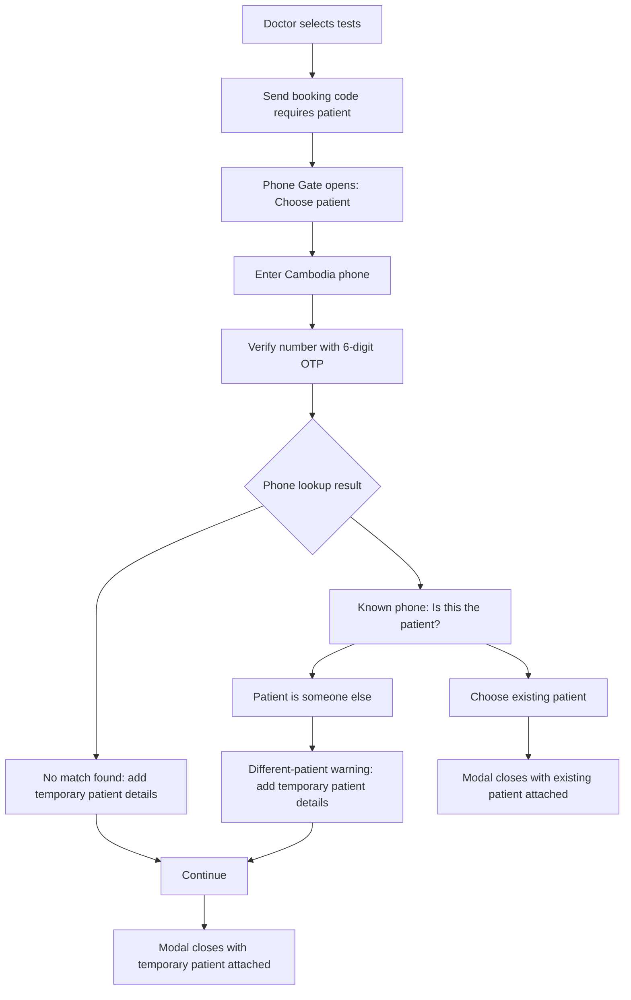

# Kura Phone Gate Modal - Journey and UI Spec

Source: Figma `00 Kura Brand`, section `Phone Gate`, node `742:52132`.

Scope: this document covers only the modal / popup experience used to attach or create a patient from the lab catalog order draft. It intentionally excludes the catalog page, order cart, payment handling, and post-modal rail UI except where needed to describe the modal outcome.

## 1. Modal Purpose

The Phone Gate is a safety checkpoint before a booking code is sent. It makes the doctor confirm the phone number and the person taking the tests without forcing complete identity verification inside the modal.

Primary jobs:

- Capture a Cambodia phone number.
- Verify the phone by OTP.
- Detect whether the phone maps to an existing Kura patient.
- Let the doctor either choose the existing patient or create a temporary patient for a different/no-match person.
- Preserve operational safety with a persistent reminder: reception/PSC can finish ID checks later.

Non-goals:

- Do not expose a full patient search experience in this modal.
- Do not collect ID card, insurance, address, or clinical history.
- Do not make this modal responsible for final identity verification.

## 2. High-Level Journey

## 3. Base Modal Shell

Use a centered desktop dialog over the current Lab Catalog screen.

- Width: `790px`.
- Height variants:
  - Phone entry: `326px`.
  - OTP: `290px`.
  - Existing-patient match: `259px`.
  - No-match / different-patient form: `473px` to `506px`.
- Shape: white surface, `12px` radius.
- Border: `#e6e9f1`.
- Shadow: soft elevated shadow, visually equivalent to `0 8px 12px rgba(26, 31, 46, 0.12)`.
- Layout: two panes.
  - Left interaction pane: `528px` wide, white, `21-22px` padding, vertical rhythm around `16px`.
  - Right safety pane: `262px` wide, white, border-left `#e6e9f1`, centered content.
- Close affordance:
  - Detached circular button outside the modal top-right.
  - Size: `32px`.
  - White fill, `#e6e9f1` stroke, pill radius, subtle shadow.
  - Icon: gray close icon.
  - Accessible label: `Close patient identity gate`.

Backdrop behavior:

- Keep the underlying catalog visible but inert.
- Do not close on accidental backdrop click for this safety checkpoint.
- `Esc` may close only if no entered data would be lost; otherwise show a lightweight unsaved-data confirmation.

## 4. Persistent Safety Pane

Component: `PhoneGateBeforeSendPane`

This appears in every modal state.

Content:

- Illustration: identity/clipboard line illustration in brand blue.
- Small warning row:
  - Icon: warning triangle.
  - Label: `BEFORE YOU SEND`.
  - Text color: `#8a5600`.
  - Letter spacing may be slightly increased if matching Figma, but keep readable.
- Body copy:
  - `Confirm the phone and the person taking the tests. Reception can finish ID checks later.`
  - Text color: `#475066`.
  - Font: Kura body, `13px`, medium, line height about `19.5px`.

Instruction:

- Treat this as reassurance and responsibility framing, not a blocking alert.
- Do not change this pane per branch unless there is a true safety escalation.
- Never rely on the warning color alone; keep the explicit `BEFORE YOU SEND` label.

## 5. State 1 - Choose Patient / Enter Phone

Trigger: user attempts to send or continue an order without an attached patient.

Visible copy:

- Title: `Choose patient`
- Subtitle: `Start with a patient, guardian, or guarantor phone.`
- Primary button: `Continue`

Components:

- Country selector:
  - Width `126px`, height `48px`.
  - Background `#f6f7fa`, radius `8px`.
  - Shows Cambodia flag, `KH`, `+855`, and dropdown chevron.
- Phone input:
  - Height `48px`, fills remaining row width.
  - Background `#f6f7fa`, radius `8px`.
  - Placeholder/example: `12 345 678`.
  - Use tabular or steady-width numerals if available.
- Primary CTA:
  - Full-width within left pane, height `44px`.
  - Brand blue `#268cff`, pill radius.
  - White medium label.

Behavior:

- Default focus lands in the phone input.
- Continue is disabled until the phone has a valid local Cambodia number.
- On Continue:
  - Normalize to E.164 internally.
  - Send OTP.
  - Move to OTP state.
- Country selector is visually present but Cambodia is the default and expected route. If no other countries are supported, keep it non-editable or explain the limitation in the dropdown.

Validation:

- Empty: keep helper text quiet until submit.
- Invalid length/format: show inline error under the phone row.
- Rate-limited OTP: keep user on this state and show a non-destructive error banner.

## 6. State 2 - Verify Number

Visible copy:

- Back action: `Change phone`
- Title: `Verify number`
- Subtitle: `Enter the 6-digit SMS code sent to +855 70 ... 496.`
- Primary button: `Verify code`

Components:

- Back link:
  - Left arrow icon plus label.
  - Brand blue `#268cff`.
  - Placed top-left inside left pane.
- OTP input:
  - Six boxes, each `52px` square.
  - Radius `8px`, white fill, `#e6e9f1` border.
  - Gap about `10px`.
  - Centered horizontally.
- Primary CTA:
  - Full-width, height `44px`, brand blue, pill radius.

States shown in Figma:

- Empty OTP: six empty boxes.
- Partial OTP: first four boxes filled (`1`, `2`, `3`, `4`), remaining boxes empty.

Required implementation states:

- Empty.
- Partial.
- Complete, before verification.
- Verifying/loading.
- Invalid code.
- Expired code.
- Resend available / resend countdown.

Behavior:

- Numeric keyboard on mobile.
- Auto-advance after each digit.
- Backspace moves to the previous box when the current box is empty.
- Paste distributes a 6-digit code across all boxes.
- Verify button is disabled until all six digits are present.
- `Change phone` returns to the phone entry state and clears OTP.

## 7. State 3 - Known Phone Match

Branch condition: the verified phone belongs to an existing Kura patient.

Visible copy:

- Back action: `Change phone`
- Title: `Is this the patient?`
- Patient card:
  - Avatar initials: `SC`
  - Name: `Sokha Chann`
  - Meta: `Female - 32y - MRN ...34`
  - Button: `Choose`
- Secondary button: `Patient is someone else`

Component: `PhoneGatePatientMatchCard`

- Card fill white.
- Border `#e6e9f1`.
- Radius `8px`.
- Height about `64px`.
- Avatar: compact square/rounded mark with neutral fill.
- Patient name: ink-900, semibold.
- Patient meta: muted ink.
- `Choose` button: brand blue pill, compact width.

Behavior:

- `Choose` attaches the existing patient and closes the modal.
- `Patient is someone else` proceeds to the different-patient form.
- Do not reveal extra PHI beyond the minimum match confirmation shown in Figma.

Safety rule:

- This is an identity-sensitive branch. The secondary action must be clear and prominent enough that a doctor can avoid attaching the wrong record.

## 8. State 4 - Known Phone, Different Patient

Branch condition: user selected `Patient is someone else` after a known-phone match.

Visible copy:

- Back action: `Change phone`
- Warning banner:
  - Title: `This looks like a different patient`
  - Body: `This phone belongs to another Kura patient. Confirm this is a different person.`
- Field label: `Verified phone`
- Phone value: `070 123 496`
- Field labels: `Full name`, `DOB or age`, `Sex`
- Placeholders:
  - `Patient name`
  - `12-09-1994 or 32`
- Segmented values: `Female`, `Male`, `Other`
- Primary button: `Continue`

Components:

- Warning banner:
  - Background warm pale yellow.
  - Radius `8px`.
  - Title in warm warning text.
  - Body in muted text.
- Verified phone row:
  - Country selector same as phone entry.
  - Phone value container has success background `#e7f8ee`.
  - Include check icon and lock icon.
  - Include an unlock/edit affordance named `Unlock phone number`.
- Detail form:
  - Name and DOB/age fields are two equal columns, about `235px` each.
  - Field background `#f6f7fa`, radius `8px`, height `44px`.
  - Sex segmented control uses `#eef0f5` track, white selected pill.

Behavior:

- Phone is locked after OTP verification.
- Unlocking the phone returns to phone edit/verification because changing it invalidates the OTP.
- Continue requires at minimum:
  - Full name.
  - DOB or age.
  - Sex.
  - Verified phone remains present.
- On Continue, create a temporary patient attached to this order, with audit context that the phone had an existing match and the doctor chose a different person.

Safety rule:

- This branch should be logged. It intentionally allows a legitimate shared-phone scenario, but it must not silently create duplicates.

## 9. State 5 - No Match Found

Branch condition: verified phone has no patient match.

Visible copy:

- Back action: `Change phone`
- Info banner:
  - Title: `No match found`
  - Body: `Add details. Kura will check for possible duplicates.`
- Field label: `Verified phone`
- Phone value: `099 111 222`
- Field labels: `Full name`, `DOB or age`, `Sex`
- Empty placeholders:
  - `Patient name`
  - `12-09-1994 or 32`
- Filled example:
  - Full name: `Pierre`
  - DOB or age: `32`
  - Sex: `Female`
- Primary button: `Continue`

Components:

- Info banner:
  - Background `#e6f9fd`.
  - Title color `#0e7490`.
  - Radius `8px`.
- Verified phone row:
  - Same as the different-patient form.
  - Success phone container `#e7f8ee`.
- Detail fields:
  - Same form component as the different-patient branch.

Behavior:

- Empty detail form shows placeholders.
- Filled form keeps the selected sex pill visually active.
- Continue creates a temporary patient and closes the modal.
- Kura should run duplicate checks after the user enters details, but the modal copy should remain calm and non-accusatory.

## 10. Modal Outcome

Existing patient selected:

- Modal closes.
- Order draft is attached to the existing patient.
- Booking can proceed with patient context.

Temporary patient created:

- Modal closes.
- Order draft shows the new temporary patient context.
- Example outcome visible in Figma:
  - `For Pierre`
  - `PROV-0001 - New patient - Phone checked`
  - Status note: `PSC will confirm identity`
  - Supporting copy: `Phone checked. Not matched in Kura.`

Instruction:

- The modal should not overclaim identity confidence.
- Use `Phone checked` for OTP verification.
- Use `PSC will confirm identity` to signal the handoff and avoid implying ID verification is complete.

## 11. Component Inventory

### 11.1 `PhoneGateModal`

Props:

- `state`: `enterPhone | verifyOtp | knownMatch | differentPatient | noMatch | submitting | error`
- `phone`
- `otp`
- `matchPatient`
- `draftPatient`
- `onClose`
- `onChangePhone`
- `onSubmitPhone`
- `onVerifyOtp`
- `onChoosePatient`
- `onCreateTemporaryPatient`

Responsibilities:

- Own modal focus trap.
- Render the correct left-pane content.
- Always render `PhoneGateBeforeSendPane`.
- Prevent unsafe dismissal when user-entered data exists.

### 11.2 `PhoneGatePhoneInput`

Props:

- `countryCode`
- `nationalNumber`
- `verified`
- `locked`
- `error`
- `onChange`
- `onUnlock`

Variants:

- Empty.
- Entered but unverified.
- Verified and locked.
- Invalid.
- Loading lookup.

### 11.3 `PhoneGateOtpInput`

Props:

- `length`: default `6`.
- `value`
- `disabled`
- `error`
- `onChange`
- `onComplete`

Requirements:

- Supports paste.
- Supports keyboard navigation.
- Announces errors with `aria-live`.
- Keeps each digit input labelled, for example `Digit 1 of 6`.

### 11.4 `PhoneGatePatientMatchCard`

Props:

- `initials`
- `name`
- `sex`
- `age`
- `mrnMasked`
- `onChoose`

Instruction:

- Keep PHI minimal.
- Use a single primary action: `Choose`.
- Pair it with the modal-level secondary action `Patient is someone else`.

### 11.5 `PhoneGatePatientDetailsForm`

Props:

- `name`
- `dobOrAge`
- `sex`
- `phone`
- `mode`: `noMatch | differentPatient`
- `onChange`
- `onSubmit`

Validation:

- Full name required.
- DOB or age required.
- Sex required.
- Do not allow Continue while a phone re-verification is required.

### 11.6 `PhoneGateBeforeSendPane`

Props:

- `title`: default `BEFORE YOU SEND`.
- `body`: default `Confirm the phone and the person taking the tests. Reception can finish ID checks later.`

Instruction:

- Keep this component visually stable across all states.
- It is allowed to collapse or stack below the form on narrow mobile widths, but the message must remain visible before final Continue/Choose.

## 12. Required UI States

| State | Primary action | Secondary action | Blocking condition |
| --- | --- | --- | --- |
| Enter phone | Continue | Close | Invalid phone |
| OTP empty | Verify code | Change phone | Less than 6 digits |
| OTP partial | Verify code | Change phone | Less than 6 digits |
| OTP verifying | Loading | None | Network/OTP pending |
| OTP invalid | Verify code | Change phone / resend | Invalid or expired code |
| Known match | Choose | Patient is someone else | None |
| Different patient | Continue | Change phone | Missing required details |
| No match empty | Continue | Change phone | Missing required details |
| No match filled | Continue | Change phone | None |
| Submit temporary patient | Loading | None | Request pending |
| Offline/error | Retry | Change phone | Connectivity or lookup failure |

## 13. Copy Rules

Use calm, specific copy. Avoid vague confirmation language.

Preferred:

- `Verify number`
- `Change phone`
- `This phone belongs to another Kura patient. Confirm this is a different person.`
- `Add details. Kura will check for possible duplicates.`
- `PSC will confirm identity`

Avoid:

- `Are you sure?`
- `Submit`
- `OK`
- `Something went wrong`
- `Patient verified` unless an actual ID verification has happened.

## 14. Accessibility

- Use `role="dialog"` and `aria-modal="true"`.
- Dialog title must be connected with `aria-labelledby`.
- First focus:
  - Phone state: phone input.
  - OTP state: first OTP box.
  - Known match: `Choose` or patient card heading, depending on implementation.
  - Detail form: full name field.
- Trap focus inside the modal.
- Return focus to the triggering button when closed.
- Close button must have text alternative `Close patient identity gate`.
- OTP errors and async verification failures should use `aria-live="polite"`.
- Do not rely on color alone for info/warning/success states; pair color with text and icon.
- All interactive targets should be at least `32px` high, preferably `44px` for primary mobile-compatible actions.

## 15. Analytics Events

Track only product behavior, not raw OTP or sensitive detail values.

- `phone_gate_opened`
- `phone_gate_phone_submitted`
- `phone_gate_otp_sent`
- `phone_gate_otp_verified`
- `phone_gate_otp_failed`
- `phone_gate_known_match_shown`
- `phone_gate_existing_patient_chosen`
- `phone_gate_patient_someone_else_clicked`
- `phone_gate_no_match_shown`
- `phone_gate_temp_patient_created`
- `phone_gate_closed`
- `phone_gate_error_shown`

Recommended event properties:

- `source_surface`: `lab_catalog_order_draft`
- `order_item_count`
- `lookup_result`: `known_match | no_match | error`
- `created_patient_type`: `temporary`
- `phone_country`: `KH`
- `close_reason`: `x_button | escape | backdrop_blocked | completed`

Do not log full phone numbers, OTP digits, patient names, or DOB values in analytics.

## 16. Implementation Notes

- The OTP-verified phone field should be treated as immutable until explicitly unlocked.
- Changing the phone clears OTP state and lookup result.
- A known-phone different-patient creation must create an audit entry because it is a duplicate-risk workflow.
- Temporary patients should be labelled as temporary/provisional in downstream UI until PSC identity confirmation.
- The modal should remain fast and narrow in scope: phone, OTP, match decision, and minimum temporary-patient details only.
